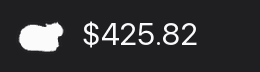
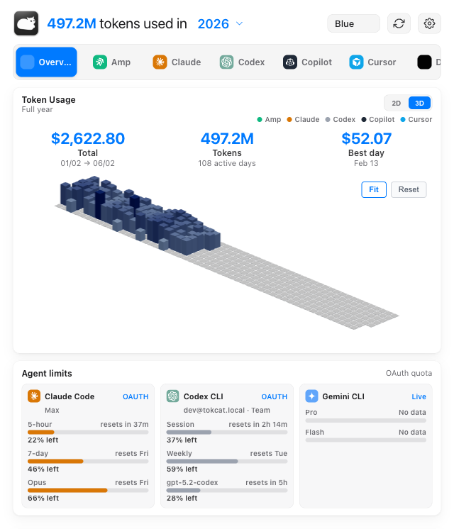
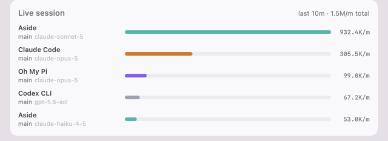
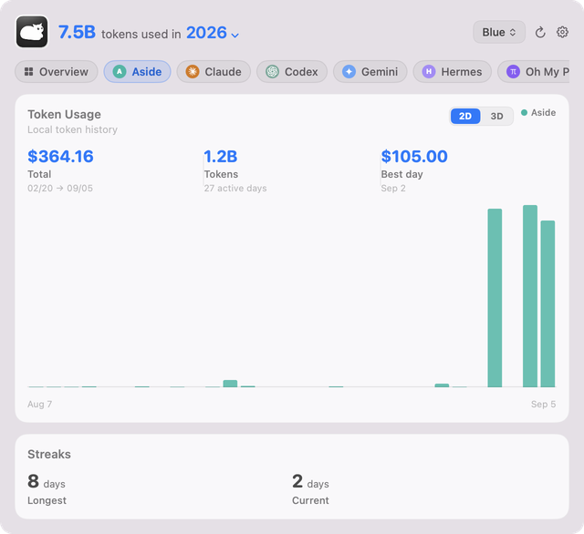
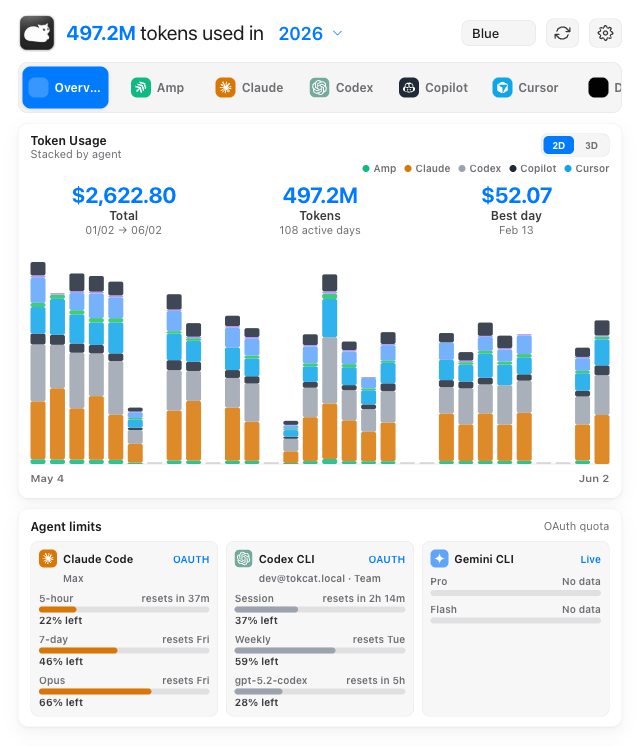
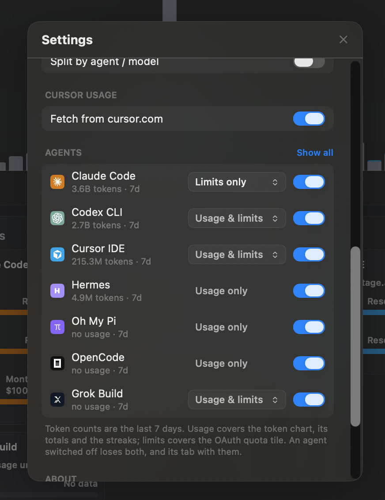
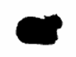

<h1 align="center">Tokcat</h1>

<p align="center">
  <strong>AI token usage monitor for the macOS menu bar.</strong>
</p>

<p align="center">
  <a href="README.md">English</a> |
  <a href="README.ko-KR.md">한국어</a>
</p>

<p align="center">
  <a href="https://github.com/handlecusion/tokcat/releases/latest"></a>
  <a href="https://github.com/handlecusion/tokcat/stargazers"></a>
  <a href="https://opensource.org/licenses/MIT"></a>
  
  
  
</p>

<br>

You spent **$2,513.67** on AI coding tools in the last four months. You don't know that, because you can't see it.

**Tokcat** is an **AI token usage monitor for the macOS menu bar** — a local-first **Claude Code usage**, **Codex usage**, **Cursor usage**, and **LLM cost tracker** for AI coding agent usage. It is a **native Swift app** (SwiftUI + AppKit, SceneKit for the 3D graph) with no web view and no bundled runtime: Tokcat sits in the macOS menu bar — no Dock icon, no telemetry, no Tokcat account — and surfaces **12 AI coding clients** (Claude Code, Codex CLI, Cursor IDE, OpenCode, Gemini CLI, Copilot CLI, Amp, Droid, Hermes, Grok Build, Oh My Pi, Aside) in an Overview dashboard plus per-client tabs. The menu-bar title can show today's tokens, today's cost, totals, live tokens/min, plan usage percent, or icon-only mode; clicking opens a frosted-glass popover with 2D stacked token bars, an interactive 3D contribution graph, OAuth agent-limit cards, Live session throughput, streak summaries, theme selection, and settings. Tokcat rebuilds local usage data in-process every **30 minutes**, checks for **Sparkle**-signed updates on launch and hourly, and ships as one **universal DMG** for **Apple Silicon and Intel Macs, macOS 13+**. Install: `brew install --cask handlecusion/tokcat/tokcat`.

<p align="center">
  
</p>

<p align="center">
  
</p>

---

## Quick Start

```sh
brew install --cask handlecusion/tokcat/tokcat
```

That's it. The fully-qualified `user/tap/cask` form auto-taps `handlecusion/homebrew-tokcat`. Open **Tokcat** from `/Applications` — the cat shows up in the menu bar, the Dock stays clean, and clicking the icon opens the dashboard.

The in-app updater (Sparkle 2) checks for new releases on launch and hourly after that; the downloaded `.app.tar.gz` is verified against the EdDSA public key embedded in the app before install.

> Prefer a one-off DMG? Grab `Tokcat_<version>_universal.dmg` from
> [Releases](https://github.com/handlecusion/tokcat/releases) — one universal
> build covers Apple Silicon and Intel. No separate token-usage CLI is
> required.
>
> On macOS 11 or 12? The last release that supports those versions is the
> Tauri-era `v0.1.42`; the native app requires macOS 13.

---

## Find Tokcat by use case

Tokcat is built for the category searches people actually type when AI coding bills get fuzzy:

- **AI token usage monitor** for the **macOS menu bar**
- **Claude Code usage** tracker for local session logs
- **OpenAI Codex usage** and **Codex cost** tracker
- **Cursor usage** and **Cursor AI token** dashboard
- **LLM cost tracker** for AI coding agent usage across Claude Code, Codex CLI, Cursor IDE, Copilot CLI, Gemini CLI, OpenCode, Amp, Droid, Hermes, Grok Build, Oh My Pi, and Aside
- **AI coding dashboard** with Overview/client tabs, agent limits, live token velocity, streaks, and daily totals
- **GitHub-style 3D contribution graph** plus a recent 30-day stacked token chart

---

## Why Tokcat

| | |
|---|---|
| **Glanceable** | The menu bar title is configurable: today's tokens, today's cost, total tokens, total cost, live tokens/min, plan usage percent, or icon-only. |
| **Native** | Swift and SwiftUI end to end — `NSVisualEffectView` vibrancy, system fonts, SceneKit for the 3D graph, and light/dark adaptation from the system appearance. No web view, no JavaScript runtime. |
| **Quiet** | Lives in the menu bar — no Dock icon, no spurious notifications, auto-hides when you click another app. |
| **Honest** | Usage history comes from local session logs read on-device, except opt-in Cursor usage from cursor.com. No telemetry, no analytics, no cloud sync, no Tokcat account. |
| **Multi-client** | Tokcat reads Claude Code, Codex CLI, OpenCode, Gemini CLI, Copilot CLI, Amp, Droid, Hermes, Grok Build, Oh My Pi, and Aside logs, plus opt-in Cursor usage. |
| **Cat** | The menubar cat eats your tokens and spins faster the more it digests — your token throughput as a single, glanceable critter. |

---

## How It Works

Tokcat reads local usage logs in-process from its Swift collector layer. On demand from the tray menu, and on a 30-minute background refresh for the popover chart, it scans supported client stores, deduplicates streaming retries, normalizes token fields, estimates cost from a bundled model-price table when the source log does not include cost, and caches the graph payload in memory and on disk.

For live activity, a JSONL tailer tracks recent growth in supported session logs and turns it into a 10-minute tokens/min signal. Cursor has no local billed-token ledger, so the same Live session card can also include Cursor when Settings → Cursor usage is on: Tokcat polls Cursor's aggregated usage endpoint on an adaptive interval (15–120s, 300s after repeated 429s, paused when Cursor IDE and Cursor CLI are both quit) and diffs the totals. The same signal can drive the menu-bar title, the Live session card, and the adaptive tray animation.

<p align="center">
  
</p>

For agent-limit cards, Tokcat reads existing Codex, Claude, and Grok Build OAuth credentials plus Cursor's local session token, and asks those vendors' usage endpoints for quota windows. Those direct vendor calls are separate from the local usage history and are not telemetry.

The SwiftUI layer renders the payload as an Overview dashboard with per-client tabs. Each tab shares the same year selector, theme picker, 2D/3D usage card, limit card, live session rows, and streak summaries.

### Per-client tabs

A client tab narrows every card to one agent — here Aside, the browser agent, whose session transcripts Tokcat reads the same way it reads a CLI's.

<p align="center">
  
</p>

### 2D stacked token chart

Recent 30-day token usage, stacked by client or narrowed to the active client tab. Hover for date, token, and cost detail.

<p align="center">
  
</p>

### 3D contribution graph

Orthographic isometric projection with orbit controls and persistent camera state. The default framing auto-fits to the active tile cluster so populated days stay readable instead of getting lost in the empty future.

<p align="center">
  
</p>

### Menubar settings

A native System Settings-styled panel for the menu-bar title, plan source, Cursor usage opt-in, launch-at-login, animated tray icon, Live trace detail, per-agent visibility, and the installed version. Each agent can stay on both surfaces, the token chart only, or the OAuth quota tile only — or be switched off entirely. The dashboard header also includes a theme picker, refresh button, and year selector.

<p align="center">
  
</p>

<p align="center">
  
</p>

### A cat that eats tokens and spins

The mascot isn't decoration — it's the gauge. Tokcat's menubar cat eats whatever tokens your AI tools chew through and spins faster as it digests more. The hungrier your editor, the louder the cat. When you're idle, it dozes. When Claude Code is hammering through a refactor, it whirls. A glance at the menu bar and you know how fast your tokens are burning, without opening anything.

Pick between two styles in Settings: the spinning cat or a party parrot. During a manual refresh, the tray icon hops while Tokcat rebuilds the graph.

<p align="center">
  
</p>

---

## Features

| Feature | Details |
|---------|---------|
| **2D / 3D usage views** | Recent 30-day stacked token bars or interactive full-year 3D tile graph with orbit controls, persistent camera, and auto-fit-to-active-tiles framing. |
| **Overview + client tabs** | Switch between all-client totals and dedicated tabs for Claude Code, Codex CLI, Cursor IDE, OpenCode, Gemini CLI, Copilot CLI, Amp, Droid, Hermes, Grok Build, Oh My Pi, and Aside when data is present. |
| **Agent limits** | Codex, Claude, Grok Build, and Cursor quota cards show session, weekly, monthly, credits, model, reset, and remaining-limit windows when local credentials are available. Cursor shows one row per billing-period model pool (Cursor Models, Other Models), matching its own Plan & Usage page. Quotas are re-fetched on launch, every 30 minutes after that, when the popover opens on a snapshot older than a minute, and on demand from Refresh Now. |
| **Live menu-bar title** | Today's tokens, today's cost, total tokens, total cost, live tokens/min, plan usage percent, or icon-only. The live signal re-ticks every 5 seconds. |
| **Plan usage in the menu bar** | Show a single "% used" or "% left" number from Claude, Codex, Grok, or Cursor — or leave it on Auto, which tracks whichever window is closest to its cap. |
| **Animated tray icon** | Optional spinning cat or party parrot animation whose FPS scales with your real-time token velocity. Native `NSStatusItem` frame swaps keep the animation smooth in the macOS menu bar. |
| **Native vibrancy + glassmorphism** | Transparent SwiftUI panel over a macOS `sidebar` `NSVisualEffectView`; light/dark follows the system appearance. |
| **Menubar popover behavior** | Chromeless window, drag region on the header, auto-hides when focus leaves the app. |
| **Theme picker** | Blue, Purple, Pink, Orange, Green, and Graphite palettes persist locally and adapt to light/dark mode. |
| **Settings panel** | macOS System Settings-styled preferences with switch toggles, sectioned groups, per-agent usage/limits visibility, version info, and one-click update check. |
| **In-app updater** | Sparkle 2 with an EdDSA-signed appcast. Silent check on launch and hourly after that; manual check from the tray menu's "Check for Updates…". |
| **Launch at login** | macOS `SMAppService` — opt-in via Settings, and the toggle reconciles itself with System Settings → Login Items. |
| **Live session** | 10-minute tokens/min breakdown by client, with an optional split by agent and model. |
| **Streaks & summaries** | Longest / current streak, total tokens, total cost, daily average, best day. |
| **No telemetry** | Usage history stays local. Network calls are limited to signed update checks, direct Codex/Claude/Grok/Cursor quota lookups when credentialed, and opt-in Cursor usage (history backfill plus live polling). |

---

## Usage

After installation, launch **Tokcat** from `/Applications`. Click the cat in the menu bar to open the dashboard. Right-click for the tray menu (Open Tokcat, Settings…, Refresh Now, About Tokcat, Check for Updates…, Quit Tokcat).

<details>
<summary><strong>Keyboard & menu shortcuts</strong></summary>
<br>

| Action | Shortcut |
|---|---|
| Toggle the dashboard from anywhere | <kbd>⌃</kbd><kbd>⌘</kbd>T (global) |
| Open Settings | <kbd>⌘</kbd>,  (from tray menu) |
| Refresh now (bypass cache) | <kbd>⌘</kbd>R (from tray menu) |
| Quit Tokcat | <kbd>⌘</kbd>Q (from tray menu) |

</details>

<details>
<summary><strong>Settings</strong></summary>
<br>

| Setting | Effect |
|---|---|
| Menubar title | What the menu-bar text shows next to the icon, including live tokens/min and plan usage percent. |
| Plan source | Shown when the title is set to plan usage: which provider (Auto, Claude, Codex, Grok, Cursor) and which quota window to pin, and whether to show % used or % left. |
| Cursor usage → Fetch from cursor.com | Off by default. When on, Tokcat backfills per-event Cursor history from cursor.com, gives Cursor its own tab, and polls live usage for the Live session card. Polling pauses when Cursor IDE and Cursor CLI are both quit. |
| Launch at login | Starts Tokcat automatically when you log in (`SMAppService`). |
| Menubar icon → Animate based on token usage | Spinning cat or party parrot animation that reflects token velocity. |
| Live trace → Split by agent / model | Expands the Live trace card from one row per client into per-agent and per-model rows. |
| About → Version | Currently installed Tokcat version. Update checks live in the tray menu ("Check for Updates…"). |
| Quit Tokcat | Exits the app. |

</details>

<details>
<summary><strong>Troubleshooting</strong></summary>
<br>

**Dashboard is empty or a client is missing**

Tokcat only reads local usage logs that already exist on disk. Open the AI client, complete at least one request, then choose Refresh Now from the tray menu. If you upgraded from an older Tokcat release that showed a missing-CLI setup dialog, update via the tray menu's Check for Updates…, or `brew upgrade --cask tokcat`.

Cursor is a special case: its tab only appears while Settings → Cursor usage → Fetch from cursor.com is on (or legacy imported history exists).

**Agent limits show Error or No quota**

Limit cards use local OAuth credentials from Codex, Claude, and Grok Build. Run `codex login`, `claude`, or `grok login` to refresh those credentials, then choose Refresh Now. API-key-only Codex auth can still produce local token history, but OAuth usage limits require OAuth login. Cursor's card reads the session token Cursor stores locally — if it says the session expired, open Cursor and sign in again.

Cursor's limit card is separate from Settings → Cursor usage. That toggle backfills the contribution graph with per-event history from cursor.com and enables live-session polling; the plan percentage needs no toggle.

**The menu-bar window vanishes when I click anywhere**

That's intentional — Tokcat behaves like a native menubar popover. To keep it visible while interacting with another app, drag the window away from the menu bar by its header (anywhere outside the controls is a drag region).

**`brew install --cask tokcat` says no formula found**

Use the fully-qualified name so brew knows which tap to look in: `brew install --cask handlecusion/tokcat/tokcat`. If the tap itself is stale, refresh it with `brew update`.

**`Error: Cask tokcat exists in multiple taps`**

Earlier versions of the tap lived at `handlecusion/tokscale`; that repo was renamed to `handlecusion/homebrew-tokcat`. If you tapped the old name once, your local Homebrew still treats it as a separate tap and collides with the new one. Drop the stale tap and reinstall:

```sh
brew untap handlecusion/tokscale
brew install --cask handlecusion/tokcat/tokcat
```

**Downloaded DMG won't launch / "Tokcat is damaged" / immediate crash**

Tokcat ships ad-hoc-signed (no paid Apple Developer ID), so a DMG-installed copy hits the Gatekeeper quarantine. The Homebrew cask runs the strip + re-sign step automatically; for the manual DMG path do it yourself:

```sh
xattr -dr com.apple.quarantine /Applications/Tokcat.app
codesign --force --deep --sign - /Applications/Tokcat.app
open -na /Applications/Tokcat.app
```

**Tokcat won't start after updating from an old version**

Tokcat 0.2.0 and later require macOS 13 (Ventura). On macOS 11 or 12, stay on `v0.1.42` — the last Tauri-era release, still downloadable from Releases.

</details>

---

## FAQ

### What is Tokcat?

Tokcat is a free, open-source native macOS menu-bar app that visualizes your AI coding token usage as a 2D stacked chart and 3D GitHub-style contribution graph. Written in Swift and SwiftUI, it reads local sessions from Claude Code, Codex CLI, OpenCode, Gemini CLI, Copilot CLI, Amp, Droid, Hermes, Grok Build, Oh My Pi, and Aside, plus opt-in Cursor usage from cursor.com, in one glanceable place. Tokcat makes zero analytics requests, requires no Tokcat account, and reads token history from local session logs except for that Cursor opt-in. The app is MIT-licensed, distributed via Homebrew (`brew install --cask handlecusion/tokcat/tokcat`) and as a universal DMG from GitHub Releases, and runs on Apple Silicon and Intel Macs with macOS 13 or newer.

### How much does Tokcat cost?

Tokcat is free and open-source under the MIT licence. There is no subscription, no paid tier, and no telemetry. Install with `brew install --cask handlecusion/tokcat/tokcat`.

### Which AI coding tools does Tokcat track?

Tokcat tracks **Claude Code, OpenAI Codex CLI, OpenCode, Google Gemini CLI, GitHub Copilot CLI, Amp, Droid, Hermes, Grok Build, Oh My Pi, and Aside** from local logs, and **Cursor IDE** when Settings → Cursor usage is on. New client formats are added as parsers in Tokcat's Swift `Collector` module.

### Does Tokcat send my data anywhere?

Tokcat does not send usage history to Tokcat servers and has no telemetry, analytics, cloud sync, or Tokcat account. It does make network requests for three explicit product functions: Sparkle update checks against `https://github.com/handlecusion/tokcat/releases/latest/download/appcast.xml`; direct Codex/Claude/Grok/Cursor quota lookups against those vendors when local credentials are available; and, when Settings → Cursor usage is on, Cursor history backfill plus live aggregated-usage polls. Token-usage history for every other client is read locally from session logs.

### How is Tokcat different from CLI token-usage tools?

Tokcat is a native macOS GUI and background reader: an animated menu-bar icon that shows cost, token count, or live tokens/min, a click-to-open frosted-glass dashboard with Overview/client tabs, 2D stacked token bars, an interactive 3D tile graph, agent-limit cards, Live session rows, streaks, themes, and a System Settings-styled preferences panel. It does not require a separate token-usage CLI at runtime.

### Does Tokcat run on Intel Macs or Windows?

Tokcat ships a single universal binary for **Apple Silicon (arm64) and Intel (x86_64) Macs on macOS 13 or later**. Windows support lives in the separate `handlecusion/tokcat-window` port repo; Linux is not supported.

### How do I uninstall Tokcat?

If installed via Homebrew: `brew uninstall --cask tokcat`. If installed via DMG: drag `Tokcat.app` from `/Applications` to the Trash. Tokcat writes preferences to `~/Library/Preferences/com.handlecusion.tokcat.plist` and a small settings file under `~/Library/Application Support/com.handlecusion.tokcat`; delete those manually if you want a clean removal.

---

## Build From Source

Requires Xcode 15+ (Swift 6 toolchain) and [XcodeGen](https://github.com/yonaskolb/XcodeGen).

```sh
git clone https://github.com/handlecusion/tokcat.git
cd tokcat/native

xcodegen generate                 # writes Tokcat.xcodeproj from project.yml
open Tokcat.xcodeproj             # or build from the command line:
xcodebuild -project Tokcat.xcodeproj -scheme Tokcat \
  -configuration Release -destination 'platform=macOS' \
  CODE_SIGN_IDENTITY="-" build
```

The app logic lives in a SwiftPM package (`native/LocalPackage`) layered `UserInterface → Model → DataSource`, with the log parsers, pricing, tailer, and quota providers in `Collector`. Iterate on it without the app shell:

```sh
cd native/LocalPackage
swift build
swift test
swift run tokcat-dump graph       # prints the collected usage payload as JSON
```

`Tokcat.xcodeproj` is generated, not committed — edit `native/project.yml` instead.

<details>
<summary><strong>Releasing a new version</strong></summary>
<br>

Releases are driven by GitHub Actions (`.github/workflows/release-native.yml`). Bump both `MARKETING_VERSION` (must equal the tag) and `CURRENT_PROJECT_VERSION` (must exceed the previous release's `sparkle:version`) in `native/project.yml`, commit, push `main`, then push an annotated `v<version>` tag.

```sh
git tag -a v<VERSION> -m "<release notes>"
git push origin main
git push origin v<VERSION>
```

The workflow builds one ad-hoc-signed universal app, packages `Tokcat_<version>_universal.dmg`, and publishes **five required assets** — the DMG, `Tokcat_<version>_universal.app.tar.gz`, its minisign `.sig`, `latest.json`, and `appcast.xml`. Two update channels are served forever: `appcast.xml` + EdDSA for Sparkle (native app), and `latest.json` + minisign for any remaining 0.1.x Tauri install, which auto-updates straight into the Swift app. Never delete a release or mark one as a prerelease — `releases/latest/download/*` would then point at a release without manifests and strand updaters. The workflow also rewrites `Casks/tokcat.rb` in [`handlecusion/homebrew-tokcat`](https://github.com/handlecusion/homebrew-tokcat).

`scripts/release-native.sh` reproduces the same artifacts and gates from a local Mac; `scripts/release.sh` is the retired Tauri-era script kept only for the 0.1.x bridge.

</details>

---

## Delegating issues to Claude

When the owner puts the `claude` label on an issue, a Claude Code cloud session picks it up: it reads the issue along with the repo docs, asks its questions on the issue itself and marks it `claude:needs-info` when the requirements are too thin to implement, and otherwise works on a `claude/issue-<N>` branch and opens a pull request with a self-review note.

Nothing lands on its own. A Claude pull request auto-merges only after the owner approves it — the `approved` label, or a review **Approve** — and even then only once the required CI checks are green.

Anyone can file an issue; only the repository owner can apply the labels that start any of this. Full mechanics: [`.claude/harness/README.md`](.claude/harness/README.md).

---

## Repos involved

| Repo | Role |
|---|---|
| [`handlecusion/tokcat`](https://github.com/handlecusion/tokcat) | App source, GitHub Releases, in-app updater manifest |
| [`handlecusion/homebrew-tokcat`](https://github.com/handlecusion/homebrew-tokcat) | Homebrew tap (`Casks/tokcat.rb`) — what `brew install --cask handlecusion/tokcat/tokcat` resolves |
| [`junhoyeo/tokscale`](https://github.com/junhoyeo/tokscale) | Upstream CLI used as a reference for supported local log formats |

---

## Acknowledgements

Tokcat's local usage reader was informed by the open-source [`tokscale`](https://github.com/junhoyeo/tokscale) project. Special thanks to [@junhoyeo](https://github.com/junhoyeo) for documenting and maintaining that ecosystem knowledge.

---

## Licence

MIT. See [LICENSE](LICENSE).

<p align="center">
<br>
<code>brew install --cask handlecusion/tokcat/tokcat</code><br>
<sub>macOS 13+ · Universal (Apple Silicon + Intel) · Swift · SwiftUI · MIT</sub>
</p>
